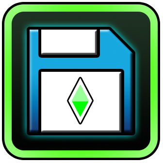

# PlatformerSaves

PlatformerSaves is a Geometry Dash mod for [Geode](https://geode-sdk.org/) that allows you to save and load your progress in platformer levels.

## Features

Pick up right where you left off and enjoy taking breaks without having to leave geometry dash open!

- Checkpoint saving and loading for platformer levels
- Auto save

## Planned features

- Multiple save slots
- Cloud saves

## Report a bug

You can report a bug by [creating an issue](https://github.com/0x5abe/PlatformerSaves/issues/new)

## Credits

- The Geode team for the amazing tool they've created and inspiring me to make GD mods
- Nikki for help with bindings